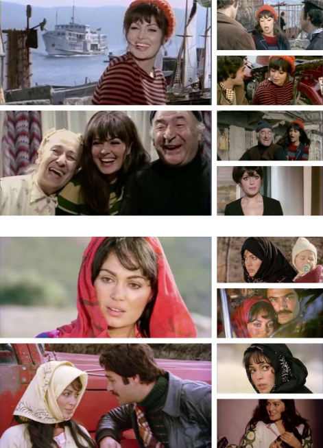

### 1- Computing Turkish Movie Stars Screen Time Using Deep Convolutional Networks

- [Paper Link](https://www.researchgate.net/publication/353326673_Computing_Turkish_Movie_Stars_Screen_Time_Using_Deep_Convolutional_Networks) - Computer Vision - Confererence
- [Conference Presentation](https://raw.githubusercontent.com/senemaktas/senemaktas.github.io/main/WebDesignsFolder/Publications/Conference_presentation.pdf) 

 <small> Computer Engineering Undergraduate final project. Gained experience in Computer Vision and Image Processing.
Presented the research at a conference through oral presentation by Senem Aktaş. Studied VGG16, InceptionV3, Xception, MobileNet, and DenseNet deep learning models. </small> 

- 
 <small> Figure 1. Examples of frames from movies </small> 

 

