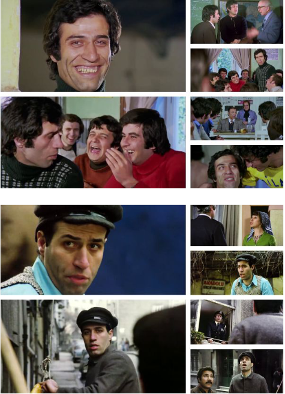
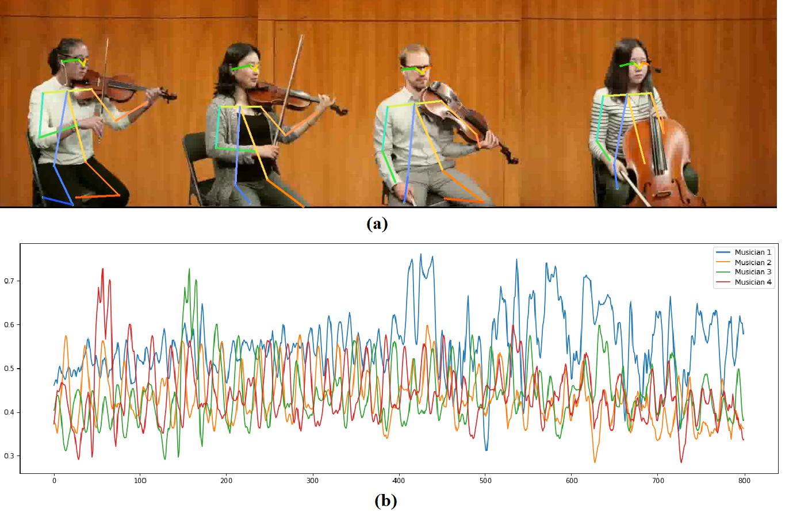
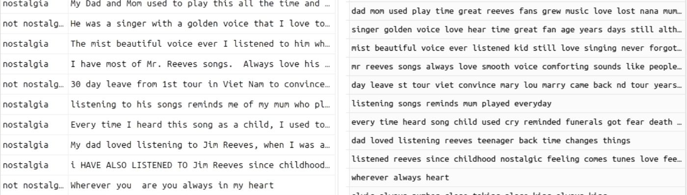
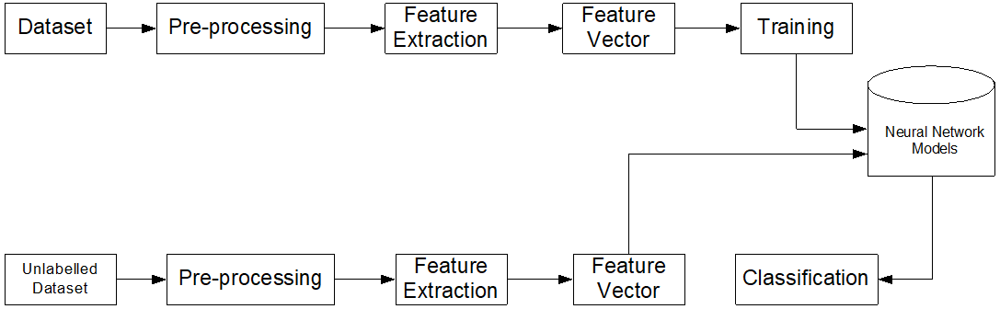
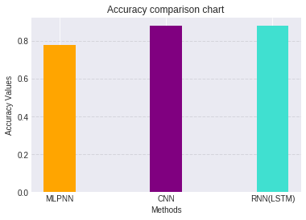

### 1- Computing Turkish Movie Stars Screen Time Using Deep Convolutional Networks

- [Paper Link](https://www.researchgate.net/publication/353326673_Computing_Turkish_Movie_Stars_Screen_Time_Using_Deep_Convolutional_Networks) - Computer Vision - Confererence
- [Conference Presentation](https://raw.githubusercontent.com/senemaktas/senemaktas.github.io/main/WebDesignsFolder/Publications/Conference_presentation.pdf) 

 <small> Computer Engineering Undergraduate final project. Gained experience in Computer Vision and Image Processing.
Presented the research at a conference through oral presentation by Senem Aktaş. Studied VGG16, InceptionV3, Xception, MobileNet, and DenseNet deep learning models. </small> 

- 
 <small> Figure 1. Examples of frames from movies </small> 

 

### 2- Beat Estimation From Musician Visual Cues

- [Paper Link](https://www.researchgate.net/publication/352934838_BEAT_ESTIMATION_FROM_MUSICIAN_VISUAL_CUES) - Computer Vision - Confererence
- [Conference Presentation](https://raw.githubusercontent.com/senemaktas/senemaktas.github.io/main/WebDesignsFolder/Publications/BeatEstimation_presentation.pdf) 

 <small> This paper aims to discover a robust technique that can identify musical phases (beats) through
visual cues derived from a musician’s body movements captured through camera sensors.A multi-instrumental
dataset was used to carry out a comparative study of two different approaches: (a) motiongram, and (b) pose estimation, 
to detect phase from body sway. </small> 
  

### 3- Comparison of Neural Network Models for Nostalgic Sentiment Analysis of YouTube Comments

- [Paper Link](https://dergipark.org.tr/en/download/article-file/1506505) - Natural Language Processing - Journal
- 
 <small>  Postalcioglu, S , Aktas, S . (2020). Comparison of Neural Network Models for Nostalgic Sentiment Analysis of YouTube Comments . Hittite Journal of Science and Engineering , 7 (3) , 215-221 . DOI: 10.17350/HJSE19030000191  </small> 
 

 

<bold> Before - After Preprocessing Dataset </bold>

 

<bold> System Architecture </bold> 

 

 
<!--  -->

### 4- Benchmarking EfficientTAM on FMO datasets

- [Paper Link](https://arxiv.org/abs/2509.06536) - Computer Vision - Confererence
- [Conference Presentation](https://raw.githubusercontent.com/senemaktas/senemaktas.github.io/main/WebDesignsFolder/Publications/...) 

Aktas, S., Markham C., McDonald J., & Dahyot R. (2025).“Benchmarking EfficientTAM on FMO datasets”.  Irish Machine Vision and Image Processing (IMVIP) Conference, (59-66), Derry-Londonderry, Northern Ireland.

Abstract
Fast and tiny object tracking remains a challenge in computer vision and in this paper we first intro-
duce a JSON metadata file associated with four open source datasets of Fast Moving Objects (FMOs) image
sequences. In addition, we extend the description of the FMOs datasets with additional ground truth infor-
mation in JSON format (called FMOX) with object size information. Finally we use our FMOX file to test
a recently proposed foundational model for tracking (called EfficientTAM) showing that its performance
compares well with the pipelines originally taylored for these FMO datasets. Our comparison of these state-
of-the-art techniques on FMOX is provided with Trajectory Intersection of Union (TIoU) scores. The code
and JSON is shared open source allowing FMOX to be accessible and usable for other machine learning
pipelines aiming to process FMO datasets.

