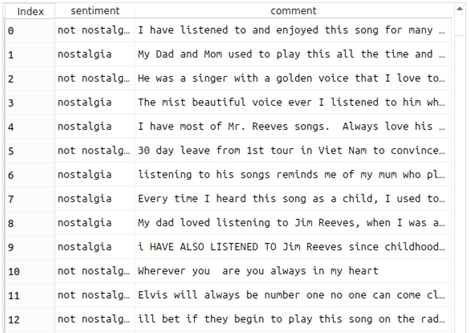
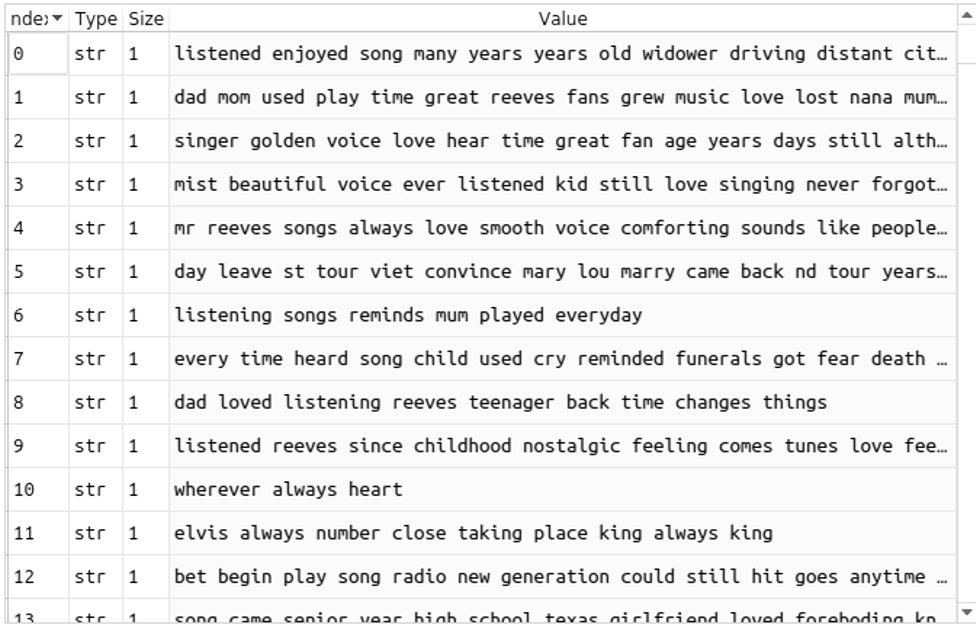

I have several journal and conferences publications on Computer Vision and Natural Language Processesing.
I contunie academic studies beside my professionel activities. 
Information on each publications can be found below. You can view them by clicking the links.

## 1- Computing Turkish Movie Stars Screen Time Using Deep Convolutional Networks

- [Publication](https://www.researchgate.net/publication/353326673_Computing_Turkish_Movie_Stars_Screen_Time_Using_Deep_Convolutional_Networks)
- <h4> Explanation: </h4>  
Undergraduate final project under the supervision of Dr Şafak Kayıkçı. Gained experience in Computer Vision 
and Image Processing. Presented the research at a conference through oral presentation by Senem Aktaş.

- Figure 1. Examples of frames from movies

## 2- Beat Estimation From Musician Visual Cues

- [Publication](https://www.researchgate.net/publication/352934838_BEAT_ESTIMATION_FROM_MUSICIAN_VISUAL_CUES)
- <h4> Explanation: </h4>  
 - Computer Vision

## 3- Comparison of Neural Network Models for Nostalgic Sentiment Analysis of YouTube Comments

- [Publication](https://dergipark.org.tr/en/download/article-file/1506505)
- <h4> Explanation: </h4>  
  - Natural Language Processing

## 4- Soon
- [Publication]

- <h4> Explanation: </h4>  

