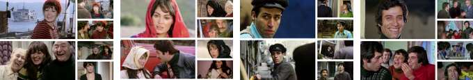

### 1- Computing Turkish Movie Stars Screen Time Using Deep Convolutional Networks

- [Paper Link](https://www.researchgate.net/publication/353326673_Computing_Turkish_Movie_Stars_Screen_Time_Using_Deep_Convolutional_Networks) - Computer Vision - Confererence
<embed
    src="http://infolab.stanford.edu/pub/papers/google.pdf#toolbar=0&navpanes=0&scrollbar=0"
    type="application/pdf"
    frameBorder="0"
    scrolling="auto"
    height="100%"
    width="100%"
></embed>

<embed src="https://github.com/senemaktas/senemaktas.github.io/blob/e539a528d77af595e0e64cf1674894c82597e5cc/WebDesignsFolder/Publications/Conference_presentation.pdf" frameBorder="0" scrolling="auto" height="100%"  width="100%"> </embed>

 <small> Computer Engineering Undergraduate final project. Gained experience in Computer Vision and Image Processing.
Presented the research at a conference through oral presentation by Senem Aktaş. Studied VGG16, InceptionV3, Xception, MobileNet, and DenseNet deep learning models. </small> 

- 
 <small> Figure 1. Examples of frames from movies </small> 

### 2- Beat Estimation From Musician Visual Cues

- [Paper Link](https://www.researchgate.net/publication/352934838_BEAT_ESTIMATION_FROM_MUSICIAN_VISUAL_CUES) - Computer Vision - Confererence

 <small> This paper aims to discover a robust technique that can identify musical phases (beats) through
visual cues derived from a musician’s body movements captured through camera sensors.A multi-instrumental
dataset was used to carry out a comparative study of two different approaches: (a) motiongram, and (b) pose estimation, 
to detect phase from body sway. </small> 
  

### 3- Comparison of Neural Network Models for Nostalgic Sentiment Analysis of YouTube Comments

- [Paper Link](https://dergipark.org.tr/en/download/article-file/1506505) - Natural Language Processing - Journal
- 
 <small>  Postalcioglu, S , Aktas, S . (2020). Comparison of Neural Network Models for Nostalgic Sentiment Analysis of YouTube Comments . Hittite Journal of Science and Engineering , 7 (3) , 215-221 . DOI: 10.17350/HJSE19030000191  </small> 
 

 

<bold> Before - After Preprocessing Dataset </bold>

 

<bold> System Architecture </bold> 

 

 
<!--  -->

### 4- Soon
- [Paper Link]

