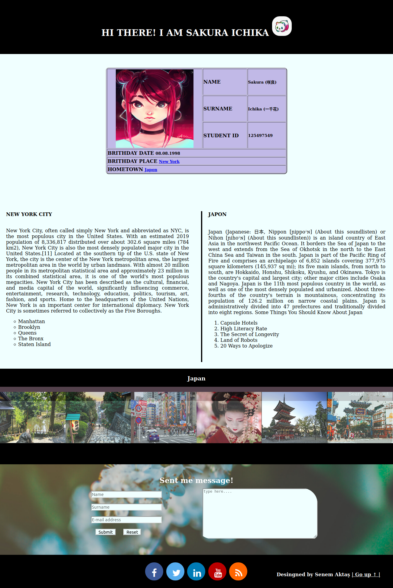
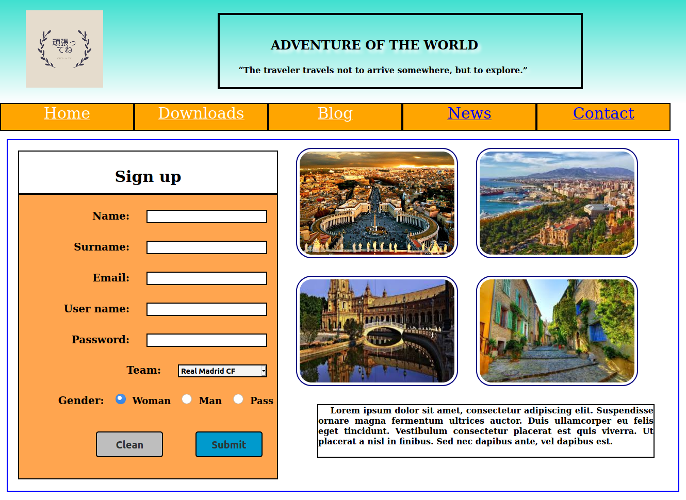

I enjoy designing websites in different styles. Trying to change to improve each design. 
Information on each design can be found below. You can view the pages by clicking the links.

## 1- Representation With Table- Sakura Ichıka

[link](../WebDesignsFolder/RepresentationwithTable/RepresentationWithTable.html)

## 2- Registeration - Adventure Of The World

[link](../WebDesignsFolder/Registration/registeration.html)

## 3- 

Sources: 
- https://mdbootstrap.com/snippets/jquery/ascensus/28?action=full_screen_mode#css-tab-view
- https://www.mockplus.com/blog/post/bootstrap-4-footer-template
- https://codepen.io/NamiqNamaz/pen/QZYyEq
- https://mdbootstrap.com/docs/jquery/navigation/compositions/
- https://mdbootstrap.com/snippets/jquery/temp/2746467?action=prism_export
- https://mdbootstrap.com/plugins/jquery/gallery/
- https://mdbootstrap.com/snippets/jquery/temp/2746472?action=prism_export
