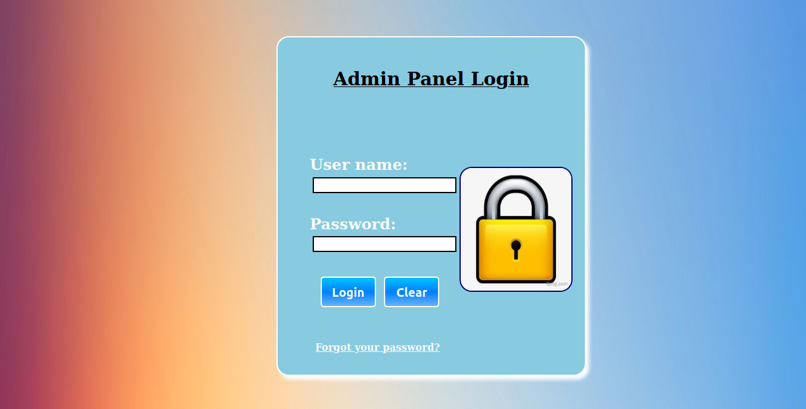
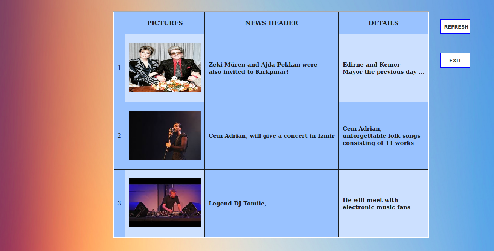

I enjoy designing websites in different styles. Trying to change to improve each design. 
Information on each design can be found below. You can view the pages by clicking the links.

## 1- Representation With Table- Sakura Ichıka

- [Web page](../WebDesignsFolder/RepresentationwithTable/RepresentationWithTable.html)
- [Codes](https://github.com/senemaktas/Web-FrontEnd/tree/master/RepresentationWithTable)
- <h4> Explanation: </h4>  

## 2- Registeration - Adventure Of The World

- [Web page](../WebDesignsFolder/Registration/registeration.html)
- [Codes](https://github.com/senemaktas/Web-FrontEnd/tree/master/Registeration)
- <h4> Explanation: </h4>  

## 3- Blog Landing Page - Music is Life
- [Web page](../WebDesignsFolder/BlogLandingPage/BlogLandingPage.html)
- [Code](https://github.com/senemaktas/Web-FrontEnd/tree/master/BlogLandingPage)
- <h4> Explanation: </h4>  

## 4- Login & Admin Panel Pages
- [Web page](../WebDesignsFolder/AdminPanel/LoginPanel.html)
- [Code](https://github.com/senemaktas/Web-FrontEnd/tree/master/AdminPanel)
- <h4> Explanation: </h4>  

