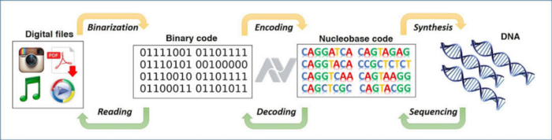

Photo by [News Mag](https://www.flickr.com/photos/newsmag/) From [Flickr](https://www.flickr.com/)

 Veri depolamak için çeşitli teknolojiler ve cihazlar bulunmaktadır. Ancak gün geçtikçe artan veri miktarı daha
fazla depolama alanı ihtiyacı doğurmuştur. Depolanan verinin uzun süreler boyunca saklanabilmesi, korunabilmesi için yeni yöntemler 
üzerinde çalışılmasına neden olmuştur. Bu yeni yöntemlerden biri DNA‘da veri depolama olmuştur. 

 Deoksiribo Nükleik asit kısaca DNA, tüm organizmalar ve bazı virüslerin canlılık işlevleri ve biyolojik gelişmeleri için gerekli olan genetik talimatları taşıyan bir nükleik asittir. Başlıca rolü bilginin uzun süreli saklanması olan bir DNA sarmalı genelde başka DNA parçaları ile etkileşmez , farklı kromozomlar fiziksel olarak ayrı tutulur. Bu özellik DNA’nın kararlı bir bilgi deposu olarak işlev görmesinde önemli bir rol oynar. Ayrıca DNA bu bilgileri tutmak için oldukça az yer kaplamaktadır. Bütün bu özellikler araştırmacıları DNA’yı veri depolama aracı olarak kullanma konusunda çalışmaya yönlendirmiştir.

 Şekil 1'in, yapılan depolama işlemini güzel bir şekilde özetlediğini düşünüyorum. Ses ,metin , görüntü vb. dosyalar girdi verisi olarak kullanılabilir. Çünkü Binarization işlemi ile girdi verileri bilgisayarın anlayacağı dil olan 0 ve 1'li yapıya dönüştürülür. 

 İlk aşamadan sonra Encoding (Kodlama) işlemi gelmektedir. Goldman Group’un bu konu ile ilgili yayınladığı çalışmalardan biri olan “Method for Encoding and Decoding Arbitrary Computer Files in DNA Fragments” adlı çalışmada kayıpsız olarak veriyi sıkıştırıp tekrar açmak için kullanılan bir kodlama yöntemi olan Huffman encoding kullanılmıştır. Bu karakterlerin frekanslarına göre bir kodlama yapmasını sağlar. Bu aşamada 0 ve 1'li yapıdaki veriler A,T,C ve G bazlarını içeren dizi haline gelir. Örnek projenin Python uygulamasına buradan ulaşabilirsiniz. 

 Synthesis aşamasında kodlaması yapılan girdi verilerinin sentezlenmesi aşamasıdır. Yani her veriye özgü hazırlanmış DNA sarmallarını oluşturma aşamasıdır. Böylece DNA’da depolama gerçekleştirilmiş olur. 

Şekil 1 : DNA Encoding -Decoding Özet

 Veri depolamayı başardık fakat bu veriyi kullanmak istediğimizde yapılması gereken bir dizi tersine işlem gerekmektedir. İlk olarak bazların sırasını belirlemek için Sequencing (sıralama) işlemi yapılır. Daha sonra basitçe Encoding işleminin tersi olarak ifade edilebilecek olan Decoding (Kod çözme) aşaması gelir. Bu aşamada A,T,C ve G bazlarını içeren dizi 0 ve 1'li yapıya tekrar dönüştürülür. Reading (okuma) ile veriler tekrar kullanılabilir aşamasındadır. 

 Bütün bu aşamalar çalışmaların genel mekanizmasını oluşturur diyebiliriz. Ekstra aşamalar mevcut olabilir. Yapılan çalışmalarda önemli olan ve dikkat edilmesi gereken noktalardan bazıları verilerin kayıpsız ve doğru bir şekilde dönüştürülüp, tekrar elde edilmesidir. Bu kısımda kullanılan yöntem, algoritma vb. işlemlerin seçimleri çalışma başarımı için önemlidir. 

 Tablo 1'de DNA as a digital information storage device: hope or hype? adlı çalışmadan alınan , DNA ve diğer depolama cihazları hakkında veri saklanma süresi, yoğunluğu , güç kullanımı ve erişim zamanı değerleri verilmiştir. 

Tablo 1 : DNA as a digital information storage device: hope or hype?

 Sonuç olarak en iyi sonuçlar için çalışmalar devam etmektedir.Bu teknolojinin hayatımıza yeni girmesinden ve gelişim aşamasında olmasından dolayı maliyetli işlemler içerir. Fakat beraberinde çok fazla katkı sağlayacaktır. Çünkü DNA, , son derece düşük enerjili depolama gerektiren, güvenli olan, yedeklemesi kolay , doğanın kalıcı veri deposudur.  

